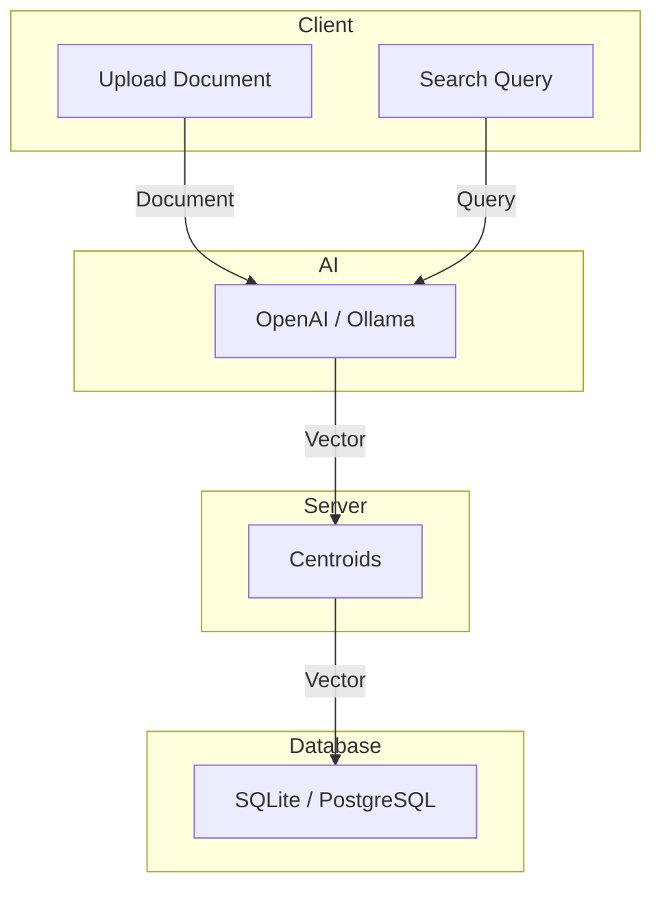

# VectorSearch

Vectorsearch is a high-performance vector search engine that indexes AI-generated embeddings from uploaded documents, files, and text. It features a fast search interface powered by a Flat index with centroids generated using a divide-and-conquer strategy for efficient multi-core processing. Supports AVX-accelerated CPU execution, with GPU support planned. This library is to be imported as a vector search engine in projects and it's UI is not meant for production use.

## Demo: [https://vectorsearch.vdh.dev/](https://vectorsearch.vdh.dev/)

## Design



## Technologies Used

- **Cosine Similarity**  
  Cosine similarity measures the similarity between two vectors by calculating the cosine of the angle between them.
  This is used to produce a percentage match between documents and user search queries. 

- **Vector Flat Index**  
  Vector Flat Index samples a set of vectors from the dataset to act as centroid allowing search quries to be narrowed down to smaller subsets on which the vector search can occure.
  This indexing method enables data to be inserted without rebuilding the index (a very expensive operation in vector databases).

- **Divide and Conquer**  
  Divide and Conquer strategy sub-divides the main problem into subproblems solving which can be solved easier and in parallel.
  This solves the scalability problem of Vector Flat Index. 

- **Quantization**  
  Quantization reduces the memory footprint of vector embeddings without significantly impacting result accuracy.
  This project scales all float64 (8-byte) & float32 (4-byte) vectors to 1-byte with weights targeting 99.8% accuracy.

- **Gonum**  
  Enables AVX, AVX2 & AVX512 CPU acceleration of Cosine Similarity enabling a ×10 faster Cosine Similarity. 

- **Gorgonia**  
  Provides alternative AVX CPU acceleration to Gonum and will power the GPU acceleration in the future.

- **Gorm**  
  A Golang Object-Relational Mapper enabling strongly typed Relational Database queries.

## Development

This project has five main components:

1. Compute  
  The `compute/` directory implements the Cosine Similarity and Quantization methods.

2. Database  
  The `database/` directory implements PostgreSQL / SQLite client connection and auto migration schema.

3. Divide and Conquer  
  The `dnc/` directory implements the flat vector indexing implementation utilizing a custom Divide and Conquer strategy. 

4. Divide and Conquer  
  The `server/` implements the libary methods and API methods to use the vector search engine. 

5. Website  
  The `ui/` directory implements vector search engine website where users can upload and search. 

- Dependancies
  - Linux (or Windows with WSL), Windows (not fun to get working)
  - Golang >=1.24.3
  - GCC => 8.0
  - Node >= 22.0
  - OpenAI / Ollama API URL

- Run development
```bash
go run .
```

- Build for production
```bash
./build.sh
```

## Operations

Running the executable will produce a `config.json` file in the current directory. Modify this file to configure your database settings and other parameters.

### Run App
The configuration file is auto generated if it does not exist.

#### Linux

```bash
./build/vectorsearch ./config.json
```

#### Windows

```powershell
./build/vectorsearch ./config.json
```

### Configuration
The `config.json` file contains all necessary configuration for the application, including:
- Database type (SQLite or PostgreSQL)
- Connection strings for each database type
- Ollama server URL
Not all configuration is required, the autogenerated configuration is sufficient for a MVP installation.
```json
{
    "server": {
        "http_address": ":7500",
        "https_address": ":7501"
    },
    "tls": {
        "dns": ["computer001.localdomain"],
        "ip": ["192.168.1.100"],
        "certificates": [
            {
                "cert_path": "/etc/ssl/certs/server.pem",
                "key_path": "/etc/ssl/private/server.pem"
            }
        ]
    },
    "database": {
        "sqlite": "./vectors.db",
        "postgres": ["host=localhost user=vectorsearch password=1234 dbname=vectordb port=9920 sslmode=disable"],
        "postgres_readonly": ["host=localhost user=vectorsearch password=1234 dbname=vectordb port=9920 sslmode=disable"]
    },
    "ollama": {
        "url": "https://ollama.vdh.dev",
        "embed": "nomic-embed-text",
        "generate": "llama3.2",
        "chat": "llama3.2",
        "token": "bearer-auth-token-1234"
    },
    "cache": "./cache/",
    "log_level": "error"
}
```
